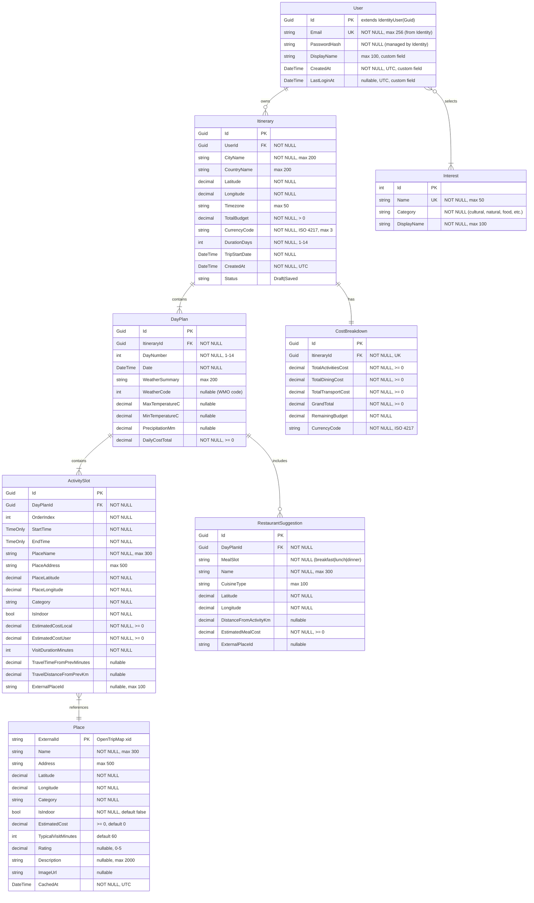

# Data Model: Travel Itinerary Generator

**Feature Branch**: `001-travel-itinerary-generator`
**Date**: 2026-03-06

---

## Entity Relationship Diagram

---

## Entity Descriptions

### User

Represents a registered account. **Extends `IdentityUser<Guid>`** from ASP.NET Core Identity. Only the three custom fields below are added — all other standard Identity fields (`NormalizedEmail`, `SecurityStamp`, `ConcurrencyStamp`, `PhoneNumber`, `LockoutEnd`, etc.) are inherited and managed by the Identity framework. `AppDbContext` extends `IdentityDbContext<User, IdentityRole<Guid>, Guid>`.

**Custom fields** (added on top of IdentityUser):

| Field | Type | Notes |
|-------|------|-------|
| `DisplayName` | string | Optional, max 100 chars |
| `CreatedAt` | DateTime | Set on registration, UTC |
| `LastLoginAt` | DateTime? | Updated on each login, UTC |

**Validation rules**:

- `Email`: required, valid email format, unique (enforced by Identity)
- `PasswordHash`: managed by Identity — never exposed via API
- `DisplayName`: optional, max 100 characters

---

### Interest

A predefined catalog of travel interests. Seeded at application startup via `HasData` in `AppDbContext.OnModelCreating`. Users select from this list when requesting an itinerary.

**Seed data** (initial catalog):

| Name | Category | Display Name |
|------|----------|--------------|
| `museums` | cultural | Museums |
| `parks` | natural | Parks & Gardens |
| `food` | food | Food & Dining |
| `nightlife` | amusements | Nightlife |
| `shopping` | shops | Shopping |
| `history` | cultural | History & Heritage |
| `landmarks` | cultural | Landmarks |
| `adventure` | sport | Adventure & Sports |
| `beaches` | natural | Beaches |
| `art` | cultural | Art & Galleries |

**Mapping to OpenTripMap categories**: `cultural` → `cultural`, `natural` → `natural`, `food` → `foods`, `amusements` → `amusements`, `shops` → `shops`, `sport` → `sport`.

---

### Itinerary

The top-level trip plan entity. Owned by a specific user. Contains all metadata about the trip request and serves as the aggregate root.

**Validation rules**:

- `CityName`: required, max 200 chars — validated via geocoding API (must resolve)
- `TotalBudget`: required, > 0
- `CurrencyCode`: required, valid ISO 4217 code (3 uppercase letters)
- `DurationDays`: required, 1–14 inclusive
- `TripStartDate`: required, must be today or future date

**State transitions**: `Draft` → `Saved` (when user explicitly calls `POST /itineraries/{id}/save`)

**Draft lifecycle**: Itineraries are persisted as `Draft` immediately upon generation. Draft rows older than 24 hours are purged on startup and periodically (configurable via `Caching:DraftExpirationHours`). This ensures the `itineraryId` from the generate response is always retrievable while preventing unbounded growth from unsaved drafts.

---

### DayPlan

A single day within an itinerary. Weather data is populated from Open-Meteo forecasts.

**Weather code**: Uses WMO weather interpretation codes. The mapping to `WeatherCondition` enum is:

| WMO Code Range | WeatherCondition | Indoor priority |
|----------------|-----------------|----------------|
| 0 | Clear | No |
| 1–3 | PartlyCloudy | No |
| 45–48 | Foggy | No |
| 51–67 | Rain | **Yes** |
| 71–77 | Snow | **Yes** |
| 80–82 | RainShowers | **Yes** |
| 95–99 | Thunderstorm | **Yes** |

WMO codes ≥ 51 trigger indoor-only activity prioritization. Temperatures > 40°C (regardless of WMO code) trigger shaded/indoor activity prioritization during 11:00–16:00 peak hours.

---

### ActivitySlot

A time-bound activity within a day. Ordered by `OrderIndex` to reflect the route-optimized sequence.

**Cost fields**:

- `EstimatedCostLocal`: cost in the destination's local currency (from OpenTripMap data or default 0)
- `EstimatedCostUser`: cost converted to user's selected currency via Frankfurter

**Time assignment**: Activities start at 09:00 on each day. Each subsequent `StartTime` = previous `EndTime` + `TravelTimeFromPrevMinutes` (rounded to nearest 5 minutes). `EndTime` = `StartTime` + `VisitDurationMinutes`.

---

### CostBreakdown

Budget utilization summary for the entire itinerary. One-to-one with Itinerary.

**Invariants** (enforced in `CostCalculationService`):
- `GrandTotal = TotalActivitiesCost + TotalDiningCost + TotalTransportCost`
- `RemainingBudget = TotalBudget - GrandTotal` (from parent Itinerary)
- `GrandTotal <= TotalBudget`

**Transport cost source**: `TotalTransportCost` is estimated by summing `TravelDistanceFromPrevKm` across all ActivitySlots and multiplying by a configurable per-km rate (`TransportRates:CostPerKm` in appsettings). Default rate: `0.15` USD/km (approximately public transit equivalent). This rate is user-currency-converted before being stored.

---

### Place (Cache Entity)

Cached place data from OpenTripMap. Not user-facing directly — used internally to avoid repeated API calls for the same locations. Accessed via `IPlacesCacheRepository`.

**Cache policy**: Stale after 7 days (`CachedAt` + 7 days, configurable via `Caching:PlaceCacheExpirationDays`). On cache miss or stale entry, re-fetch from OpenTripMap and upsert.

---

### RestaurantSuggestion

Optional dining recommendation attached to a day. Only populated when `includeRestaurants: true` in the generate request.

**MealSlot values**: `breakfast`, `lunch`, `dinner`

**Meal cost estimation**: Since OpenTripMap does not provide price range data, meal costs are estimated using configurable city-tier rates in appsettings (`TransportRates:MealCostEstimates`). Three tiers are defined: `budget` (default $8/meal), `mid` ($20/meal), `upscale` ($45/meal). The tier is selected based on the restaurant's OpenTripMap rating when available.

---

## Value Objects (Non-Persisted)

These are used in Domain logic and Application DTOs but not stored as separate tables:

| Value Object | Fields | Purpose |
|-------------|--------|---------|
| `Coordinates` | `Latitude (decimal)`, `Longitude (decimal)` | Geographic point; includes Haversine distance method |
| `Money` | `Amount (decimal)`, `CurrencyCode (string)` | Type-safe currency amount; prevents mixing currencies |
| `TimeSlot` | `Start (TimeOnly)`, `End (TimeOnly)` | Activity time window; enforces `Start < End` |
| `WeatherForecast` | `Code (int)`, `MaxTemp (decimal)`, `MinTemp (decimal)`, `Precipitation (decimal)` | Daily weather data from Open-Meteo; mapped to `WeatherCondition` enum |
| `DistanceResult` | `DistanceKm (decimal)`, `DurationMinutes (decimal)` | Travel distance/time from OpenRouteService or Haversine fallback |