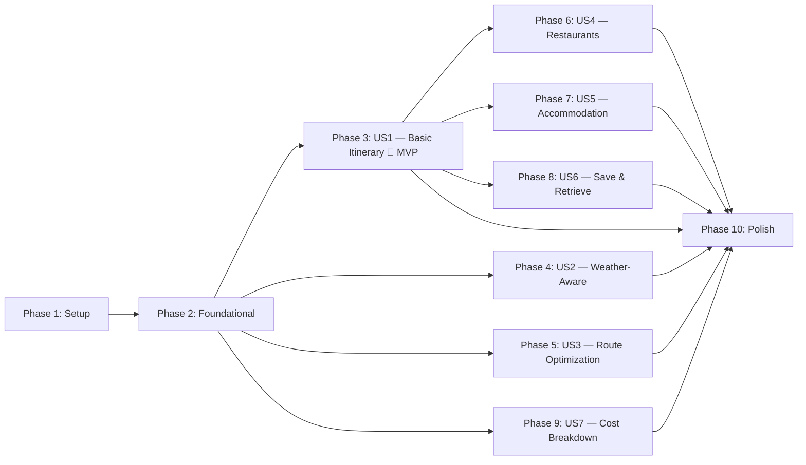

# Tasks: Travel Itinerary Generator

**Input**: Design documents from `/specs/001-travel-itinerary-generator/`
**Prerequisites**: plan.md ✅, spec.md ✅, research.md ✅, data-model.md ✅, contracts/ ✅

**Tests**: Included — constitution mandates testing discipline (Principle VI).

**Organization**: Tasks are grouped by user story to enable independent implementation and testing of each story.

## Format: `[ID] [P?] [Story] Description`

- **[P]**: Can run in parallel (different files, no dependencies)
- **[Story]**: Which user story this task belongs to (e.g., US1, US2, US3)
- Include exact file paths in descriptions

---

## Phase 1: Setup (Shared Infrastructure)

**Purpose**: Create the solution structure, configure tooling, and install all NuGet dependencies.

- [x] T001 Create .NET solution with 4 source projects and 2 test projects: `dotnet new sln`, then `SmartTravelPlanner.Api`, `SmartTravelPlanner.Application`, `SmartTravelPlanner.Domain`, `SmartTravelPlanner.Infrastructure`, `SmartTravelPlanner.UnitTests`, `SmartTravelPlanner.IntegrationTests` per plan.md project structure
- [x] T002 Configure project references: Api → Application → Domain, Infrastructure → Domain, Infrastructure → Application, UnitTests → Application + Domain, IntegrationTests → Infrastructure
- [x] T003 [P] Install NuGet packages for `src/SmartTravelPlanner.Api/SmartTravelPlanner.Api.csproj`: Swashbuckle.AspNetCore, Serilog.AspNetCore, Serilog.Sinks.Console, FluentValidation.AspNetCore, Microsoft.AspNetCore.Authentication.JwtBearer
- [x] T004 [P] Install NuGet packages for `src/SmartTravelPlanner.Application/SmartTravelPlanner.Application.csproj`: FluentValidation
- [x] T005 [P] Install NuGet packages for `src/SmartTravelPlanner.Infrastructure/SmartTravelPlanner.Infrastructure.csproj`: Npgsql.EntityFrameworkCore.PostgreSQL, Microsoft.AspNetCore.Identity.EntityFrameworkCore, Microsoft.Extensions.Http.Polly, Microsoft.Extensions.Caching.Memory, System.IdentityModel.Tokens.Jwt
- [x] T006 [P] Install NuGet packages for `tests/SmartTravelPlanner.UnitTests/SmartTravelPlanner.UnitTests.csproj`: xunit, xunit.runner.visualstudio, Moq, FluentAssertions, Microsoft.NET.Test.Sdk
- [x] T007 [P] Install NuGet packages for `tests/SmartTravelPlanner.IntegrationTests/SmartTravelPlanner.IntegrationTests.csproj`: xunit, xunit.runner.visualstudio, Moq, FluentAssertions, Microsoft.NET.Test.Sdk, RichardSzalay.MockHttp
- [x] T008 Create `src/SmartTravelPlanner.Api/appsettings.json` with configuration structure from quickstart.md (ExternalApis, Jwt, ConnectionStrings, Caching sections)
- [x] T009 Create `src/SmartTravelPlanner.Api/appsettings.Development.json` with development-specific overrides and Serilog console sink
- [x] T010 Verify solution builds with `dotnet build` — zero warnings

**Checkpoint**: Solution compiles, all projects reference each other correctly.

---

## Phase 2: Foundational (Blocking Prerequisites)

**Purpose**: Core domain entities, interfaces, database, auth, middleware, and external API client infrastructure. MUST complete before any user story.

**⚠️ CRITICAL**: No user story work can begin until this phase is complete.

### Domain Layer — Entities & Value Objects

- [x] T011 [P] Create `Coordinates` value object in `src/SmartTravelPlanner.Domain/ValueObjects/Coordinates.cs` with Latitude, Longitude properties and Haversine distance method
- [x] T012 [P] Create `Money` value object in `src/SmartTravelPlanner.Domain/ValueObjects/Money.cs` with Amount (decimal) and CurrencyCode (string) properties
- [x] T013 [P] Create `TimeSlot` value object in `src/SmartTravelPlanner.Domain/ValueObjects/TimeSlot.cs` with Start, End (TimeOnly) and validation Start < End
- [x] T014 [P] Create `InterestCategory` enum in `src/SmartTravelPlanner.Domain/Enums/InterestCategory.cs` with values: Cultural, Natural, Food, Amusements, Shops, Sport
- [x] T015 [P] Create `WeatherCondition` enum in `src/SmartTravelPlanner.Domain/Enums/WeatherCondition.cs` with values mapped from WMO weather codes (Clear, PartlyCloudy, Rain, Snow, Thunderstorm)
- [x] T016 [P] Create `Interest` entity in `src/SmartTravelPlanner.Domain/Entities/Interest.cs` with Id, Name, Category, DisplayName per data-model.md
- [x] T017 [P] Create `User` entity in `src/SmartTravelPlanner.Domain/Entities/User.cs` extending IdentityUser with DisplayName, CreatedAt, LastLoginAt per data-model.md
- [x] T018 [P] Create `Place` cache entity in `src/SmartTravelPlanner.Domain/Entities/Place.cs` with ExternalId, Name, Address, Coordinates, Category, IsIndoor, EstimatedCost, TypicalVisitMinutes, Rating, CachedAt per data-model.md
- [x] T019 [P] Create `ActivitySlot` entity in `src/SmartTravelPlanner.Domain/Entities/ActivitySlot.cs` with all fields per data-model.md
- [x] T020 [P] Create `DayPlan` entity in `src/SmartTravelPlanner.Domain/Entities/DayPlan.cs` with weather fields and navigation to ActivitySlot collection per data-model.md
- [x] T021 [P] Create `CostBreakdown` entity in `src/SmartTravelPlanner.Domain/Entities/CostBreakdown.cs` with cost fields and invariant validation per data-model.md
- [x] T022 [P] Create `RestaurantSuggestion` entity in `src/SmartTravelPlanner.Domain/Entities/RestaurantSuggestion.cs` with MealSlot, Name, CuisineType, Coordinates, EstimatedMealCost per data-model.md
- [x] T023 Create `Itinerary` entity in `src/SmartTravelPlanner.Domain/Entities/Itinerary.cs` with all fields and navigation properties to DayPlan and CostBreakdown per data-model.md

### Domain Layer — Interfaces

- [x] T024 [P] Create `IWeatherClient` interface in `src/SmartTravelPlanner.Domain/Interfaces/IWeatherClient.cs` — GetForecastAsync(Coordinates, int days)
- [x] T025 [P] Create `IPlacesClient` interface in `src/SmartTravelPlanner.Domain/Interfaces/IPlacesClient.cs` — SearchPlacesAsync(Coordinates, radius, categories)
- [x] T026 [P] Create `IRoutingClient` interface in `src/SmartTravelPlanner.Domain/Interfaces/IRoutingClient.cs` — GetDistanceMatrixAsync(List<Coordinates>)
- [x] T027 [P] Create `IGeocodingClient` interface in `src/SmartTravelPlanner.Domain/Interfaces/IGeocodingClient.cs` — GeocodeAsync(string cityName)
- [x] T028 [P] Create `ICurrencyClient` interface in `src/SmartTravelPlanner.Domain/Interfaces/ICurrencyClient.cs` — GetExchangeRateAsync(string from, string to)
- [x] T029 [P] Create `IItineraryRepository` interface in `src/SmartTravelPlanner.Domain/Interfaces/IItineraryRepository.cs` — CRUD operations for Itinerary
- [x] T030 [P] Create `IUserRepository` interface in `src/SmartTravelPlanner.Domain/Interfaces/IUserRepository.cs` — user lookup operations
- [x] T031 [P] Create `IPlacesCacheRepository` interface in `src/SmartTravelPlanner.Domain/Interfaces/IPlacesCacheRepository.cs` — GetByExternalIdAsync, UpsertAsync for Place cache entity

### Infrastructure Layer — Database

- [x] T032 Create `AppDbContext` in `src/SmartTravelPlanner.Infrastructure/Persistence/AppDbContext.cs` — extends IdentityDbContext, configures all entity mappings (Itinerary, DayPlan, ActivitySlot, CostBreakdown, Interest, Place, RestaurantSuggestion) with Fluent API
- [x] T033 Create initial EF Core migration in `src/SmartTravelPlanner.Infrastructure/Persistence/Migrations/`
- [x] T034 Create `ItineraryRepository` in `src/SmartTravelPlanner.Infrastructure/Persistence/Repositories/ItineraryRepository.cs` implementing `IItineraryRepository`
- [x] T035 [P] Create `UserRepository` in `src/SmartTravelPlanner.Infrastructure/Persistence/Repositories/UserRepository.cs` implementing `IUserRepository`
- [x] T036 [P] Create `PlacesCacheRepository` in `src/SmartTravelPlanner.Infrastructure/Persistence/Repositories/PlacesCacheRepository.cs` implementing `IPlacesCacheRepository` with 7-day staleness check

### Infrastructure Layer — Authentication

- [x] T037 Create `JwtTokenService` in `src/SmartTravelPlanner.Infrastructure/Auth/JwtTokenService.cs` — generate and validate JWT tokens using configuration from appsettings
- [x] T038 Create `AuthService` in `src/SmartTravelPlanner.Application/Services/AuthService.cs` with `IAuthService` interface — register, login, token generation orchestration

### Infrastructure Layer — External API Clients (resilience wrappers)

- [x] T039 [P] Implement `NominatimGeocodingClient` in `src/SmartTravelPlanner.Infrastructure/ExternalApis/Nominatim/NominatimGeocodingClient.cs` — implements `IGeocodingClient`, uses HttpClientFactory, 1 req/sec rate limit, caches results (city data is static)
- [x] T040 [P] Implement `FrankfurterCurrencyClient` in `src/SmartTravelPlanner.Infrastructure/ExternalApis/Frankfurter/FrankfurterCurrencyClient.cs` — implements `ICurrencyClient`, no auth, cache rates for 24 hours
- [x] T041 [P] Implement `OpenMeteoWeatherClient` in `src/SmartTravelPlanner.Infrastructure/ExternalApis/OpenMeteo/OpenMeteoWeatherClient.cs` — implements `IWeatherClient`, no auth, fetches daily forecast (weather_code, temp max/min, precipitation), cache for 6 hours
- [x] T042 [P] Implement `OpenTripMapPlacesClient` in `src/SmartTravelPlanner.Infrastructure/ExternalApis/OpenTripMap/OpenTripMapPlacesClient.cs` — implements `IPlacesClient`, API key from config, search by radius + categories, map OpenTripMap categories to InterestCategory enum
- [x] T043 [P] Implement `OpenRouteServiceRoutingClient` in `src/SmartTravelPlanner.Infrastructure/ExternalApis/OpenRouteService/OpenRouteServiceRoutingClient.cs` — implements `IRoutingClient`, API key from config, distance matrix endpoint, profile from config

### Infrastructure Layer — Resilience & Caching

- [x] T044 Create `InMemoryCacheService` in `src/SmartTravelPlanner.Infrastructure/Caching/InMemoryCacheService.cs` — wraps IMemoryCache with configurable TTLs from appsettings (places: 7d, weather: 6h, forex: 24h)
- [x] T045 Configure Polly resilience policies in `src/SmartTravelPlanner.Infrastructure/Extensions/HttpClientExtensions.cs` — retry with exponential backoff (3 attempts), circuit breaker (5 failures → 30s open), timeout (10s) for all external API HttpClients

### API Layer — Middleware & Configuration

- [x] T046 Create `GlobalExceptionMiddleware` in `src/SmartTravelPlanner.Api/Middleware/GlobalExceptionMiddleware.cs` — catch unhandled exceptions, log with Serilog, return RFC 7807 Problem Details
- [x] T047 Create `ServiceCollectionExtensions` in `src/SmartTravelPlanner.Api/Extensions/ServiceCollectionExtensions.cs` — register all DI services: DbContext, Identity, JWT auth, HttpClients with Polly, repositories, application services
- [x] T048 Configure `Program.cs` in `src/SmartTravelPlanner.Api/Program.cs` — Serilog setup, Swagger/OpenAPI, JWT bearer auth, CORS, health checks, middleware pipeline, interest seed data
- [x] T049 Create `AuthController` in `src/SmartTravelPlanner.Api/Controllers/AuthController.cs` — POST /api/auth/register, POST /api/auth/login per contracts/auth.md
- [x] T050 Create auth request/response DTOs: `RegisterRequest`, `LoginRequest`, `AuthResponse`, `UserResponse` in `src/SmartTravelPlanner.Api/DTOs/`

### Health Checks

- [x] T051 Create `HealthController` in `src/SmartTravelPlanner.Api/Controllers/HealthController.cs` — GET /api/health per contracts/health.md, aggregating health checks for database and all external APIs

**Checkpoint**: Foundation ready — solution builds, database migrates, auth works (register/login), all external API clients implemented with resilience, health checks operational. User story implementation can now begin in parallel.

---

## Phase 3: User Story 1 — Generate a Basic Itinerary (Priority: P1) 🎯 MVP

**Goal**: User provides city, budget, duration, and interests. System returns a day-by-day itinerary with time-slotted activities, estimated costs, and travel times — all within budget.

**Independent Test**: Send POST `/api/itineraries/generate` with valid city, budget, duration, and interests. Verify response contains structured multi-day plan with places, costs, and time slots within budget.

### Tests for User Story 1

- [x] T052 [P] [US1] Unit test for `ItineraryGenerationService` in `tests/SmartTravelPlanner.UnitTests/Application/ItineraryGenerationServiceTests.cs` — test orchestration with mocked API clients: verify 3-day plan returned, activities match interests, total cost ≤ budget
- [x] T053 [P] [US1] Unit test for `CostCalculationService` in `tests/SmartTravelPlanner.UnitTests/Application/CostCalculationServiceTests.cs` — test budget distribution across days, per-category breakdown sums to grand total, remaining budget calculation
- [x] T053a [P] [US1] Unit test for `CurrencyConversionService` in `tests/SmartTravelPlanner.UnitTests/Application/CurrencyConversionServiceTests.cs` — verify currency conversion and fallback mechanisms
- [x] T053b [P] [US1] Unit test for `AuthService` in `tests/SmartTravelPlanner.UnitTests/Application/AuthServiceTests.cs` — verify JWT generation, login, and registration flows
- [x] T054 [P] [US1] Unit test for `GenerateItineraryRequestValidator` in `tests/SmartTravelPlanner.UnitTests/Application/GenerateItineraryRequestValidatorTests.cs` — test all validation rules: city required, budget > 0, duration 1–14, interests min 1, valid currency code, trip date ≥ today

### Implementation for User Story 1

- [x] T055 [P] [US1] Create `GenerateItineraryRequest` and `ItineraryResponse` DTOs in `src/SmartTravelPlanner.Api/DTOs/Requests/GenerateItineraryRequest.cs` and `src/SmartTravelPlanner.Api/DTOs/Responses/ItineraryResponse.cs` per contracts/itineraries.md
- [x] T056 [P] [US1] Create `GenerateItineraryRequestValidator` in `src/SmartTravelPlanner.Application/Validators/GenerateItineraryRequestValidator.cs` — FluentValidation rules for all input fields per FR-001, FR-013
- [x] T057 [US1] Implement `CurrencyConversionService` in `src/SmartTravelPlanner.Application/Services/CurrencyConversionService.cs` with `ICurrencyConversionService` interface — convert amounts using ICurrencyClient, fallback to source currency + notice per FR-018
- [x] T058 [US1] Implement `CostCalculationService` in `src/SmartTravelPlanner.Application/Services/CostCalculationService.cs` with `ICostCalculationService` interface — distribute budget across days and categories, compute per-day/per-category/grand-total breakdown, enforce total ≤ budget per FR-005, FR-011
- [x] T059 [US1] Implement `ItineraryGenerationService` in `src/SmartTravelPlanner.Application/Services/ItineraryGenerationService.cs` with `IItineraryGenerationService` interface — orchestrate: geocode city → fetch places → allocate places to days (3–6 per day) → calculate costs → build DayPlan/ActivitySlot objects → assemble Itinerary with CostBreakdown per FR-002, FR-003, FR-004, FR-005
- [x] T060 [US1] Create `ItinerariesController` in `src/SmartTravelPlanner.Api/Controllers/ItinerariesController.cs` — POST /api/itineraries/generate endpoint, [Authorize] attribute, call ItineraryGenerationService, return ItineraryResponse per contracts/itineraries.md
- [x] T061 [US1] Create `InterestsController` or add GET /api/itineraries/interests endpoint in `src/SmartTravelPlanner.Api/Controllers/ItinerariesController.cs` — return predefined interest catalog (public, no auth) per contracts/itineraries.md
- [x] T062 [US1] Handle edge cases in `ItineraryGenerationService`: unrecognized city (return 404 with suggestions), $0 budget (free activities only), empty interests (default to sightseeing/landmarks), duration > 14 (reject with validation error) per spec.md Edge Cases
- [x] T063 [US1] Add Serilog structured logging to `ItineraryGenerationService` — log each API call duration/status, total generation time, budget utilization percentage

**Checkpoint**: User Story 1 fully functional. Users can register, login, and generate basic itineraries. This is the MVP. Validate with quickstart.md test flow.

---

## Phase 4: User Story 2 — Weather-Aware Itinerary (Priority: P2)

**Goal**: Itinerary adjusts daily plans based on weather forecast — outdoor activities on clear days, indoor activities on rainy/extreme weather days.

**Independent Test**: Request itinerary for city with known weather. Verify rainy days have predominantly indoor activities and outdoor activities are scheduled on clear days.

### Tests for User Story 2

- [x] T064 [P] [US2] Unit test for `WeatherEnrichmentService` in `tests/SmartTravelPlanner.UnitTests/Application/WeatherEnrichmentServiceTests.cs` — mock weather client returning rainy forecast for day 3: verify day 3 has only indoor activities, mock extreme heat: verify outdoor avoided during 11:00–16:00, mock API unavailable: verify itinerary returned without weather adjustments + notice

### Implementation for User Story 2

- [x] T065 [US2] Implement `WeatherEnrichmentService` in `src/SmartTravelPlanner.Application/Services/WeatherEnrichmentService.cs` with `IWeatherEnrichmentService` interface — fetch Open-Meteo forecast, classify each day (clear/rain/extreme), reorder activities to prioritize indoor on bad-weather days, move outdoor to early/late on extreme heat days per FR-006
- [x] T066 [US2] Integrate `WeatherEnrichmentService` into `ItineraryGenerationService` — call after initial place allocation, before route optimization; add weather summary to each DayPlan; add notice if weather API unavailable per FR-015
- [x] T067 [US2] Add weather fields to `ItineraryResponse` DTO — ensure `weather` object in each day plan includes summary, weatherCode, maxTemperatureC, minTemperatureC, precipitationMm per contracts/itineraries.md

**Checkpoint**: Itineraries now include weather data and adjust activity scheduling accordingly. Previous US1 functionality unchanged.

---

## Phase 5: User Story 3 — Optimized Route Planning (Priority: P2)

**Goal**: Daily activities ordered to minimize travel time between locations using distance/routing data.

**Independent Test**: Generate itinerary, verify activities are ordered geographically — total travel distance is within 25% of optimal, consecutive activities under 45 minutes travel.

### Tests for User Story 3

- [x] T068 [P] [US3] Unit test for `RouteOptimizationService` in `tests/SmartTravelPlanner.UnitTests/Application/RouteOptimizationServiceTests.cs` — mock distance matrix with known values: verify returned order minimizes total distance, mock API unavailable: verify fallback to Haversine straight-line distance estimation

### Implementation for User Story 3

- [x] T069 [US3] Implement `RouteOptimizationService` in `src/SmartTravelPlanner.Application/Services/RouteOptimizationService.cs` with `IRouteOptimizationService` interface — fetch distance matrix from OpenRouteService, apply nearest-neighbor heuristic to order activities, calculate travel time/distance between consecutive activities per FR-007, FR-008
- [x] T070 [US3] Implement Haversine fallback in `RouteOptimizationService` — when routing API unavailable, estimate distances using straight-line calculation, add notice per FR-015
- [x] T071 [US3] Integrate `RouteOptimizationService` into `ItineraryGenerationService` — call after weather enrichment, reorder each day's activities, populate travelTimeFromPrevMinutes and travelDistanceFromPrevKm in ActivitySlot
- [x] T072 [US3] Add travel time/distance fields to activity response DTO if not already present per contracts/itineraries.md

**Checkpoint**: Daily routes are now optimized. Travel time between activities is populated. Fallback works when routing API is down.

---

## Phase 6: User Story 4 — Restaurant Recommendations (Priority: P3)

**Goal**: Optionally include nearby restaurant suggestions for each meal slot (breakfast, lunch, dinner) based on cuisine preferences and budget.

**Independent Test**: Generate itinerary with `includeRestaurants: true`. Verify each day includes 1–3 restaurant suggestions with name, cuisine, and proximity to activities. Without flag, no restaurants appear.

### Tests for User Story 4

- [x] T073 [P] [US4] Unit test for restaurant suggestion logic in `tests/SmartTravelPlanner.UnitTests/Application/ItineraryGenerationServiceTests.cs` — mock OpenTripMap returning food places: verify suggestions attached to DayPlan, meals deducted from budget; test with includeRestaurants=false: verify no restaurant data

### Implementation for User Story 4

- [x] T074 [US4] Add restaurant search method to `OpenTripMapPlacesClient` in `src/SmartTravelPlanner.Infrastructure/ExternalApis/OpenTripMap/OpenTripMapPlacesClient.cs` — search with `foods` category filter near activity cluster centroid for each day
- [x] T075 [US4] Implement restaurant suggestion logic in `ItineraryGenerationService` — for each day, find nearby restaurants for breakfast/lunch/dinner slots, filter by cuisine preferences if provided, estimate meal cost, deduct from budget, populate RestaurantSuggestion entities per FR-009
- [x] T076 [US4] Add restaurant fields to `ItineraryResponse` DTO — include `restaurants` array in each day plan per contracts/itineraries.md
- [x] T077 [US4] Handle graceful degradation — if OpenTripMap foods category returns no results or API fails, return itinerary without restaurant suggestions + notice per FR-014

**Checkpoint**: Restaurant suggestions work when enabled. Core itinerary unaffected when disabled or API unavailable.

---

## Phase 7: User Story 5 — Accommodation Suggestions (Priority: P3)

**Goal**: Optionally suggest accommodations near activity areas within budget. Deferred per research.md — no reliable free API exists.

**Independent Test**: Request itinerary with accommodation suggestions. Verify system returns itinerary with "not available" notice.

### Implementation for User Story 5

- [x] T078 [US5] Add `includeAccommodations` field to `GenerateItineraryRequest` DTO in `src/SmartTravelPlanner.Api/DTOs/Requests/GenerateItineraryRequest.cs`
- [x] T079 [US5] Implement accommodation placeholder in `ItineraryGenerationService` — when `includeAccommodations` is true, add notice "Accommodation suggestions are not yet available" to response notices array per FR-010, FR-014
- [x] T080 [US5] Create `IAccommodationClient` interface in `src/SmartTravelPlanner.Domain/Interfaces/IAccommodationClient.cs` — define contract for future implementation (SearchAccommodationsAsync)

**Checkpoint**: Accommodation flag accepted and gracefully handled. Interface ready for future API integration.

---

## Phase 8: User Story 6 — Save and Retrieve Itineraries (Priority: P3)

**Goal**: Authenticated users save generated itineraries and retrieve them later by ID. Ownership enforced.

**Independent Test**: Generate itinerary, save it (POST /save), retrieve by ID (GET /{id}), list all (GET /), delete (DELETE /{id}). Verify ownership enforced — another user cannot access.

### Tests for User Story 6

- [x] T081 [P] [US6] Unit test for save/retrieve logic in `tests/SmartTravelPlanner.UnitTests/Application/ItineraryGenerationServiceTests.cs` — test save changes status to "Saved", retrieve returns full data, retrieve with wrong userId returns null (ownership enforcement)

### Implementation for User Story 6

- [x] T082 [US6] Add save/retrieve/list/delete methods to `IItineraryRepository` and `ItineraryRepository` in `src/SmartTravelPlanner.Infrastructure/Persistence/Repositories/ItineraryRepository.cs` — include eager loading of DayPlans, ActivitySlots, CostBreakdown, RestaurantSuggestions; filter by UserId
- [x] T083 [US6] Add itinerary management endpoints to `ItinerariesController` in `src/SmartTravelPlanner.Api/Controllers/ItinerariesController.cs` — POST /api/itineraries/{id}/save, GET /api/itineraries, GET /api/itineraries/{id}, DELETE /api/itineraries/{id} per contracts/itineraries.md
- [x] T084 [US6] Create list/summary DTOs: `ItinerarySummaryResponse`, `PaginatedResponse` in `src/SmartTravelPlanner.Api/DTOs/Responses/` per contracts/itineraries.md
- [x] T085 [US6] Enforce ownership in all retrieve/delete operations — return 403 if authenticated userId ≠ itinerary.UserId per FR-012, FR-017

**Checkpoint**: Full CRUD for itineraries works. Ownership enforced. Pagination on list endpoint.

---

## Phase 9: User Story 7 — Cost Breakdown Report (Priority: P2)

**Goal**: Every itinerary includes a detailed cost breakdown — per day, per category, and grand total.

**Independent Test**: Generate itinerary, verify costBreakdown in response has per-day sums matching daily totals, per-category sums matching grand total, grand total ≤ budget.

### Tests for User Story 7

- [x] T086 [P] [US7] Unit test for cost breakdown invariants in `tests/SmartTravelPlanner.UnitTests/Application/CostCalculationServiceTests.cs` — verify grandTotal = activities + dining + transport, remainingBudget = budget - grandTotal, per-day costs sum to category totals

### Implementation for User Story 7

- [x] T087 [US7] Enhance `CostCalculationService` to compute per-day cost breakdown — aggregate ActivitySlot costs per day, add transport cost estimates (from RouteOptimizationService travel distances × per-km rate), add dining costs from RestaurantSuggestions per FR-011
- [x] T088 [US7] Add per-day cost array to `CostBreakdown` entity or `ItineraryResponse` DTO — include daily cost totals alongside category totals per contracts/itineraries.md
- [x] T089 [US7] Display remaining budget and budget utilization warning — if remaining budget < 10% of total, add notice to response per spec.md acceptance scenario (budget not fully utilized)

**Checkpoint**: Cost breakdown fully integrated. Every generated itinerary has transparent budget accounting.

---

## Phase 10: Polish & Cross-Cutting Concerns

**Purpose**: Improvements affecting multiple stories, documentation, and production readiness.

- [x] T090 [P] Add Swagger XML documentation comments to all controller actions in `src/SmartTravelPlanner.Api/Controllers/` — include request/response examples, status codes per constitution V.Observability
- [x] T091 [P] Create integration tests for external API clients in `tests/SmartTravelPlanner.IntegrationTests/ExternalApis/` — test OpenMeteoClientTests.cs, OpenTripMapClientTests.cs, OpenRouteServiceClientTests.cs, NominatimClientTests.cs, and FrankfurterClientTests.cs with mocked HTTP handlers using RichardSzalay.MockHttp
- [x] T092 [P] Create domain entity unit tests in `tests/SmartTravelPlanner.UnitTests/Domain/EntityTests.cs` — test value object equality, CostBreakdown invariants, Money arithmetic
- [x] T093 Add interest seed data migration — seed the 10 predefined interests from data-model.md into the database on startup in `src/SmartTravelPlanner.Infrastructure/Persistence/AppDbContext.cs` or `Program.cs`
- [x] T094 Configure CORS policy in `src/SmartTravelPlanner.Api/Program.cs` — allow configurable origins from appsettings
- [x] T095 Add API rate limiting middleware in `src/SmartTravelPlanner.Api/Program.cs` — use ASP.NET Core rate limiting to protect endpoints per constitution extension
- [x] T096 Create `.gitignore` entries for `appsettings.Development.json`, User Secrets, bin/, obj/ at repository root
- [x] T097 Validate full workflow end-to-end using quickstart.md test flow — register, login, generate, save, retrieve, delete, health check
- [x] T098 Run `dotnet test` — ensure all unit and integration tests pass with zero failures
- [x] T099 Run `dotnet build --warnaserror` — ensure zero warnings per constitution quality gate

---

## Dependencies & Execution Order

### Phase Dependencies

- **Setup (Phase 1)**: No dependencies — can start immediately
- **Foundational (Phase 2)**: Depends on Setup completion — BLOCKS all user stories
- **User Stories (Phases 3–9)**: All depend on Foundational phase completion
  - User stories can then proceed in parallel (if staffed)
  - Or sequentially in priority order (P1 → P2 → P3)
- **Polish (Phase 10)**: Depends on all desired user stories being complete

### User Story Dependencies



- **US1 (Basic Itinerary)**: Can start after Foundational — no story dependencies
- **US2 (Weather)**: Can start after Foundational — integrates into US1's generation flow but is independently testable
- **US3 (Route Optimization)**: Can start after Foundational — integrates into US1's generation flow but is independently testable
- **US4 (Restaurants)**: Soft dependency on US1 (needs generation pipeline to attach suggestions to)
- **US5 (Accommodation)**: Soft dependency on US1 (placeholder only)
- **US6 (Save & Retrieve)**: Soft dependency on US1 (needs generated itinerary to save)
- **US7 (Cost Breakdown)**: Can start after Foundational — enhances CostCalculationService from US1

### Within Each User Story

- Tests MUST be written first and FAIL before implementation
- Models/DTOs before services
- Services before endpoints
- Core implementation before integration/edge cases

### Parallel Opportunities

- All Foundational domain entities (T011–T023) and interfaces (T024–T031) can run in parallel
- All external API clients (T039–T043) can run in parallel
- US2 and US3 can run in parallel after US1
- US4, US5, US6 can run in parallel after US1
- All test tasks marked [P] can run in parallel within their story

---

## Parallel Example: User Story 1

```text
# Tests (in parallel):
Task T052: "Unit test for ItineraryGenerationService"
Task T053: "Unit test for CostCalculationService"
Task T054: "Unit test for GenerateItineraryRequestValidator"

# DTOs (in parallel):
Task T055: "Create GenerateItineraryRequest and ItineraryResponse DTOs"
Task T056: "Create GenerateItineraryRequestValidator"

# Then sequentially:
Task T057: "Implement CurrencyConversionService"
Task T058: "Implement CostCalculationService"
Task T059: "Implement ItineraryGenerationService" (depends on T057, T058)
Task T060: "Create ItinerariesController" (depends on T059)
```

---

## Implementation Strategy

### MVP First (User Story 1 Only)

1. Complete Phase 1: Setup
2. Complete Phase 2: Foundational (CRITICAL — blocks all stories)
3. Complete Phase 3: User Story 1 — Basic Itinerary Generation
4. **STOP and VALIDATE**: Test US1 independently using quickstart.md flow
5. Deploy/demo if ready — users can generate basic itineraries

### Incremental Delivery

1. Setup + Foundational → Foundation ready
2. Add US1 → Test independently → **Deploy (MVP!)**
3. Add US2 (Weather) + US3 (Routes) → Test → Deploy — itineraries are now smart
4. Add US7 (Cost Breakdown) → Test → Deploy — budget transparency
5. Add US4 (Restaurants) → Test → Deploy — dining enrichment
6. Add US6 (Save/Retrieve) → Test → Deploy — persistence
7. Add US5 (Accommodation placeholder) → Polish → **Final release**

### Parallel Team Strategy

With multiple developers after Foundational is done:

- **Developer A**: US1 (MVP) → US4 (Restaurants)
- **Developer B**: US2 (Weather) + US3 (Routes) → US7 (Cost Breakdown)
- **Developer C**: US6 (Save/Retrieve) → US5 (Accommodation) → Polish

---

## Summary

| Metric | Value |
|--------|-------|
| **Total tasks** | 99 |
| **Phase 1 (Setup)** | 10 tasks |
| **Phase 2 (Foundational)** | 41 tasks |
| **Phase 3 (US1 — MVP)** | 12 tasks |
| **Phase 4 (US2 — Weather)** | 4 tasks |
| **Phase 5 (US3 — Routes)** | 5 tasks |
| **Phase 6 (US4 — Restaurants)** | 5 tasks |
| **Phase 7 (US5 — Accommodation)** | 3 tasks |
| **Phase 8 (US6 — Save/Retrieve)** | 5 tasks |
| **Phase 9 (US7 — Cost Breakdown)** | 4 tasks |
| **Phase 10 (Polish)** | 10 tasks |
| **Parallel opportunities** | 48 tasks marked [P] |
| **Suggested MVP scope** | Phase 1 + Phase 2 + Phase 3 (US1) = 63 tasks |
